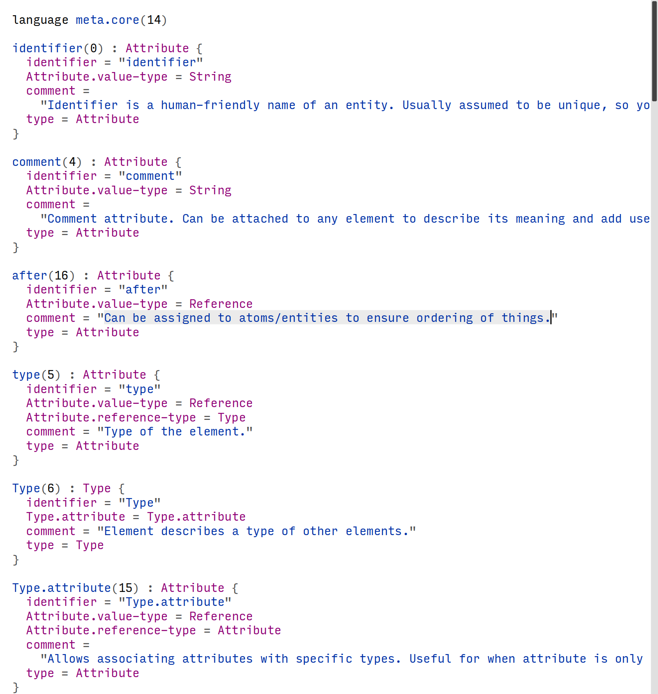
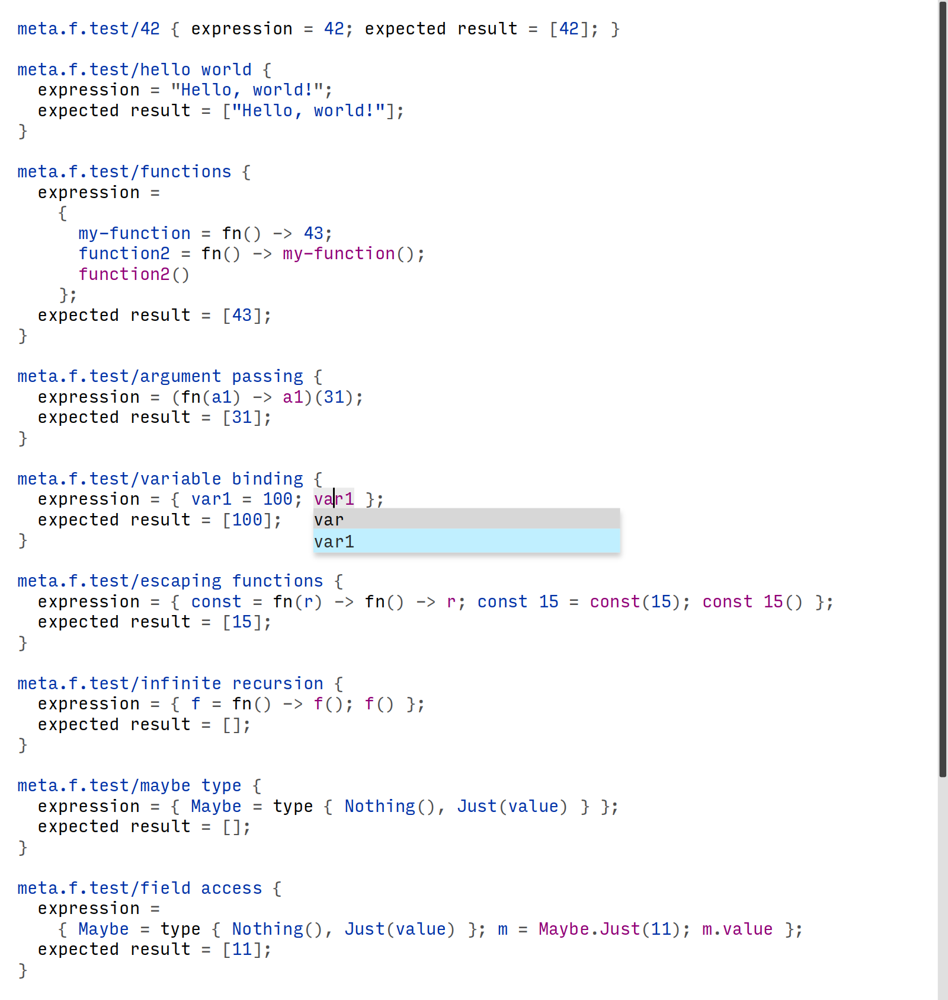

[Meta](https://github.com/rasendubi/meta) is a project I've been working on for the last 5 months.
This post is my first attempt to talk about it publicly.
I will briefly describe the core idea, but there are many adjacent areas I want to explore, so a more in-depth explanation deserves a separate post.
This post is more of a status update: how things are going and what I've been through.

<!--more-->

## What is meta

Meta is an experiment in exposing code as data using universal abstractions.

The basic building block of meta is a 4-tuple of [id, entity, attribute, value].

This is also the only building block.
Turns out, a list of entity-attribute-value tuples is enough to model any data.

If you know Datalog, Datomic, or DataScript, this should look familiar to you.
If you don't, I highly recommend the excellent [Domain Modeling with Datalog talk](https://www.youtube.com/watch?v=oo-7mN9WXTw) by Norbert Wojtowicz.
This entity-attribute-value model is the essence of Datomic and DataScript.
(One of meta implementations even used DataScript.)

All meta code can be exposed as a database.
You can query it. You can analyze it. You can edit it. You can execute it.

I use “meta” as an umbrella name for the tools I build around this format: database, editor, languages, and whatnot.
Meta is a home for my explorations.

It's possible to do many things with this format, but my primary focus is on projectional editors, extensible environment, and programming languages.

## meta.core

You can use this format to describe anything.
But to make meaning of that data, one must specify what each entity, attribute, and value means.

That's what meta.core is for—meta.core defines entities and attributes that can describe other entities, attributes, and values. meta.core is a meta description language.

Here's a snippet of meta.core:

```
identifier(0) : Attribute {
  Attribute.value-type = String
  comment = "Identifier is a human-friendly name of an entity. Usually assumed to be unique, so you could find the entity by its identifier"
}

Attribute(7) : Type {
  Type.attribute = Attribute.value-type
  Type.attribute = Attribute.reference-type
  comment = "Entity describes an attribute."
}
```

It defines a string attribute “identifier” with id 0, and an “Attribute” type with id 7.

If you say it's not entity-attribute-value tuples, it is!
It's just a different representation.
Here is how a real `identifier` looks like (`//` comments are for your understanding):

```
// identifier . identifier = "identifier"
["0", "0", "identifier"]
// identifier . type = Attribute
["0", "5", "7"]
// identifier . Attribute.value-type = String
["0", "1", "2"]
// identifier . comment = "..."
["0", "4", "Identifier is a human-friendly name of an entity. Usually assumed to be unique, so you could find the entity by its identifier."]
```

This raw representation is much harder to understand.

It's harder to write, too, but that's how I did it. I didn't have any tooling at first, so I wrote everything using my text editor.

As meta.core grew, I had developed an annotation tool, to automatically insert annotation comments for me. That helped a little, but I still had to remember all identifiers.

## meta.f

I started describing a meta.f programming language with meta.core.
I even implemented an interpreter and a printer for meta.f (so I could see the code as code and not tuples).

Calling it a programming language is an overstatement, but that's where meta.f is growing.

## meta editor

As meta.core and meta.f grew, my pain intensified, and that's when I decided I need a specialized editor.
I went for ClojureScript + Reagent (React).

First, I implemented a simple viewer for meta.core and meta.f, so I could check that what I'm writing is correct.

Then I ported the meta.f interpreter.

When I finally started adding editing features, a problem appeared: performance.
The editor was sluggish. Unforgivably sluggish. Typing a symbol caused a second of a freeze.

Long story short, there were no fast fixes. After much struggling, I decided to ditch browser rendering altogether.

## Hello, Rust

I have rewritten the editor in Rust. That took me quite a while, but it was worth it. Now, any editing provides feedback within 20ms. And I haven't spent that much time optimizing for speed!

Though I miss some opportunities the browser environment provided, I hope to port Rust to WebAssembly someday and run it in the browser.

So here is what I have now.

### meta-store

[meta-store](https://github.com/rasendubi/meta/tree/c25a0a13947b802376e77c729b889f2c033da558/meta-rs/meta-store) is an in-memory database to store all meta code.
It is similar to DataScript but does not allow compound queries.
You can query indices, and that's it—it's always one or two hashmap lookups, and it's super fast.
(DataScript querying was one of the significant contributors to the lag in the previous implementation.)

### meta-gui

I couldn't find a good and easy to use Rust GUI framework, so I rolled my own.

[meta-gui](https://github.com/rasendubi/meta/tree/c25a0a13947b802376e77c729b889f2c033da558/meta-rs/meta-gui) is a simple Immediate Mode GUI (IMGUI) framework. It's simplistic, but it does its job.

### meta-editor

[meta-editor](https://github.com/rasendubi/meta/tree/c25a0a13947b802376e77c729b889f2c033da558/meta-rs/meta-editor) is the actual editor written on top of meta-store and meta-gui. I use it exclusively to work with meta.core and meta.f. The code is a mess. But it's good enough that I never have to edit meta files with my text editor.



### meta-f compiler

I had read an excellent [Compiling with Continuations](https://www.amazon.com/Compiling-Continuations-Andrew-W-Appel/dp/052103311X) by Andrew W. Appel, and implemented [meta.f interpreter](https://github.com/rasendubi/meta/tree/c25a0a13947b802376e77c729b889f2c033da558/meta-rs/meta-f) as a CPS (Continuation Passing Style) compiler and a bytecode VM. (I also rethought the meta.f language itself.) It works for elementary programs but needs more work.



## What's next

Currently, I'm struggling with meta.f.
Here is where PLT (Programming Language Theory) bug bit me. I want to add quite a few features to meta.f (i.e., effect system, dependent typing, gradual typing), and I have no idea how to do that. (I don't even know what exactly I want.)

Being honest to myself, I have to give up some of my language ideas and implement a simpler language.

After that is done, the next step is to re-implement parts of the editor with meta.f.

Then re-implement more of the editor in meta.f, trying to make the editor _extensible_ in meta.f.

Then I'll see.
